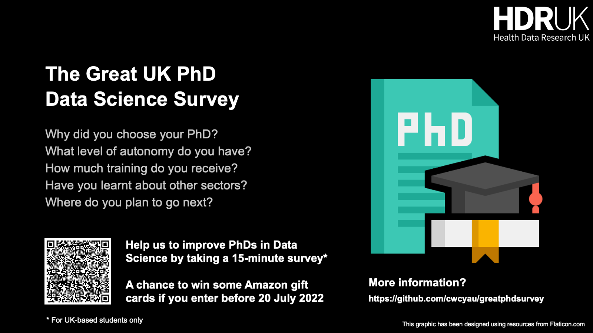

# [The Great UK PhD Data Science Survey](https://forms.gle/u55swJNChHbaKMMS6)

## Latest News 

The survey is now complete!

You can find a report on the results and the anonymised data at the corresponding [OSF project page](https://osf.io/96vp5/).

I would like to thank all the contributors for your support!

If you use the information or data from this survey, please use the following citation:

> Yau, C. (2022, October 16). The Great UK PhD Data Science Survey. Retrieved from osf.io/96vp5. DOI 10.17605/OSF.IO/96VP5

## What are we doing?

We are carrying out a [survey](https://forms.gle/u55swJNChHbaKMMS6) of UK PhD students who are working in any area of data science and I need your help! We hope to get survey responses from over 300 PhD students so please help us by sparing 10-15 minutes of your time to answer some questions.

Responses received before **20 July 2022** will be entered into a prize draw for a selection of £30 Amazon eGift cards. 

The link to the survey is available [here](https://forms.gle/u55swJNChHbaKMMS6).

After 30 July 2022, data gathered through the survey will be analysed and a written report produced for distribution in September 2022.

## Why another survey?

The purpose of this survey is to improve our understanding of student's motivations for doing a PhD, what they want to and are getting out of it, and where they want to go next. We know the world looks very different for data scientists than even just five years ago, with many exciting and lucrative opportunities coming from different parts of the ecosystem, what is the purpose of the PhD? What makes it an attractive qualification to have still? 

We also know that the experience of PhD students varies due to several factors but – as data scientists - we need more detailed data to better understand and quantitatively characterise those variations. The survey information that will be collected will help us inform discussions with universities and funders to develop new strategies and approaches for doctoral training in the UK and to cater for changing needs.  

## What is the definition of data science being used? Who should take part?

If you spend a large part of your research analysing real-world data, building computational models, or developing novel computer algorithms for analysing data then you should complete this survey. It does not matter if you are working on proteins, geology, or plasma physics, if it involves a substantiall data-focused component then please complete this survey. If you largely work on theory and/or simulations relevant to data science but not much with data itself, we are still keen to hear from you too. This survey is not so much for pure theoreticians.

## Are there questions you’ve forgotten / not included?

We tried to include as many questions as possible without making the survey too laborious. There are many issues and topics we could have addressed but we made tough choices to focus on our key areas of interest. Further surveys might go into greater depth in some areas.

## Why is the last section only on health?

This survey is being conducted in partnership with [Health Data Research UK](https://www.hdruk.ac.uk/) – the national institute for health data research. They have a particular focus on health data science and consequently we have added a few questions on this area of work. However, the responses should reveal general insights into how inter-/multi-disciplinary research and career transitions are being supported.

## What about stipends and the cost-of-living crisis?

We are deeply aware that UK PhD students are struggling with the current cost-of-living crisis and the impact of the real terms reduction in spending power offered by typical studentship stipends. We are not able to affect the decisions that must be taken by funders to address these issues but we hope that the survey information could shed light on some of the wider challenges faced by students in addition to financial support.

## Why only UK?

We would love to conduct a global survey but academic systems across the globe work quite differently and, as UK-based researchers working in the UK, it seems fitting that we would explore within the nation in which we live first.

## What will you do with the data?

We will use the survey data to generate a report detailing our survey findings by September 2022. This will be disseminated publicly. All surveys are collected anonymously except where individuals choose to provide their name and e-mail address to be entered for the prize draw. Names and e-mail addresses submitted will only be used for this purpose and will not be used for the analysis of the main survey data or for distribution.

## Contributors

[Christopher Yau](https://www.wrh.ox.ac.uk/team/christoper-yau). Professor of Artificial Intelligence at the [University of Oxford](http://www.ox.ac.uk) and [Health Data Research UK](https://www.hdruk.ac.uk/). 

Many thanks to Dominic Danks, Kaspar Martens, David Wong, Emma Whitfield, Breeshey Roskams-Hieter, Tim Frayling, Cecilia Lindgren, Angela Wood, Jose Benetiz-Aurioles, Andrew Holding, Karla DiazOrdaz, Catalina Vallejos, Woojung Kim, Iain Styles, Sarah Cadman, and many others I have forgotten for supporting the development of this survey.
